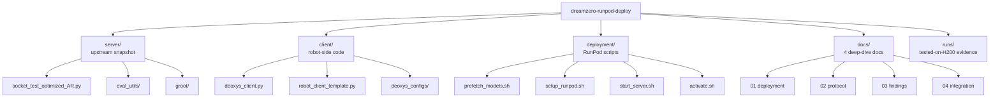

# DreamZero RunPod Deploy

End-to-end recipe for serving NVIDIA's **[DreamZero-DROID](https://huggingface.co/GEAR-Dreams/DreamZero-DROID)** 14B World Action Model on RunPod, with a ready-to-use Franka/Deoxys client and a generic template for any other robot.

> Built on top of [`dreamzero0/dreamzero`](https://github.com/dreamzero0/dreamzero) (NVIDIA GEAR Lab, Apache-2.0).
> Paper: [arXiv:2602.15922](https://arxiv.org/abs/2602.15922).
> Project page: [dreamzero0.github.io](https://dreamzero0.github.io/).

This repository captures everything needed to bring up the inference server on a fresh RunPod pod (validated on **H200** and **B200**) and connect a real Franka Panda over WebSocket. It also documents the **non-obvious conventions** we had to dig out of multiple codebases (gripper direction, action semantics, control-mode tuning, frame schedule) so the next person doesn't have to.

> **B200 (Blackwell) second deploy:** see [`docs/05_deployment_b200.md`](docs/05_deployment_b200.md) for warm-up timelines, prefetch, and Python/flash-attn gotchas.

---

## Hardware Requirements

| Resource | Minimum | What We Tested |
|---|---|---|
| GPU | H100 80 GB | H200 143 GB, **B200 183 GB** |
| VRAM in use | ~45 GB | 44.7 GB (B200) |
| Disk (persistent volume) | 200 GB | RunPod `/workspace` (persistent) |
| RAM | 64 GB | 2 TB |
| CUDA | 12.8+ | 12.8 toolkit / 13.0 driver |
| Python | 3.11 | 3.11.13 venv or **3.12 system** (B200) |

---

## Three-Step Quick Start

```bash
# On a fresh RunPod pod (PyTorch + CUDA 12.8 image), as root:
cd /workspace
git clone https://github.com/<YOU>/dreamzero-runpod-deploy.git
cd dreamzero-runpod-deploy

# 1. (Recommended) Prefetch Wan2.1 + DreamZero-DROID (~138 GB total, idempotent)
bash deployment/prefetch_models.sh

# 2. Install deps + verify GPU (also downloads checkpoint if prefetch was skipped)
bash deployment/setup_runpod.sh

# 3. Activate caches (source, not execute)
source deployment/activate.sh

# 4. Start the inference server (background)
bash deployment/start_server.sh
tail -f logs/server-*.log
```

When you see `INFO:websockets.server:server listening on 0.0.0.0:5000`, you're ready.

**Warm-up time:** ~2–4 min if `/workspace` already has checkpoints + HF/Triton cache; **~15 min** on first B200/H200 boot (Wan2.1 download + JIT compile). See [`docs/05_deployment_b200.md`](docs/05_deployment_b200.md).

For the full step-by-step (with manual fallback, troubleshooting, network exposure options) see [`docs/01_deployment_runpod.md`](docs/01_deployment_runpod.md).

---

## Connecting a Robot Client

```bash
# On the robot-control machine (separate from RunPod):
git clone https://github.com/<YOU>/dreamzero-runpod-deploy.git
cd dreamzero-runpod-deploy/client/
pip install numpy opencv-python pyrealsense2 websockets msgpack msgpack-numpy openpi-client

# Franka + Deoxys:
python deoxys_client.py \
    --host  <runpod-host>  --port 5000 \
    --interface-cfg charmander.yml \
    --controller-cfg dreamzero-joint-impedance.yml \
    --cam-ext0  <serial> --cam-ext1 <serial> --cam-wrist <serial> \
    --prompt "pick up the red block"

# Other robots: edit robot_client_template.py (4 abstract methods)
```

Full integration guide with debugging checklist: [`docs/04_client_integration.md`](docs/04_client_integration.md).

---

## Repository Layout



| Directory | Origin | What's In It |
|---|---|---|
| [`server/`](server/) | [Snapshot](NOTICE) of [dreamzero0/dreamzero@ab790c1](https://github.com/dreamzero0/dreamzero) | Inference server + model code (unchanged) |
| [`client/`](client/) | New | Robot-side WebSocket clients + Deoxys config |
| [`deployment/`](deployment/) | New | RunPod-specific bring-up scripts |
| [`docs/`](docs/) | New | Deep-dive documentation (see below) |
| [`runs/`](runs/) | New | Trimmed server log + sample MP4 outputs from our successful run |

---

## Documentation Map

| Doc | When to Read |
|---|---|
| [`docs/01_deployment_runpod.md`](docs/01_deployment_runpod.md) | First time setting up the server on RunPod |
| [`docs/02_protocol_reference.md`](docs/02_protocol_reference.md) | Writing a custom client or debugging the wire format |
| [`docs/03_research_findings.md`](docs/03_research_findings.md) | Understanding *why* gripper / control / camera choices are what they are (with source citations) |
| [`docs/04_client_integration.md`](docs/04_client_integration.md) | Wiring a real robot, especially Franka/Deoxys |
| [`docs/05_deployment_b200.md`](docs/05_deployment_b200.md) | **B200 second deploy** — prefetch, startup vs inference timing, pitfalls |

---

## What's Different From Upstream

The only files **not** present in upstream:

- `client/deoxys_client.py` — Franka/Deoxys reference client (not provided upstream)
- `client/robot_client_template.py` — Generic template with hardware abstraction
- `client/deoxys_configs/dreamzero-joint-impedance.yml` — Tuned controller config
- `deployment/prefetch_models.sh`, `setup_runpod.sh`, `start_server.sh`, `activate.sh` — RunPod deployment scripts
- `docs/*.md` — Deployment + protocol + findings documentation (incl. B200 notes)
- `runs/*` — Tested-on-H200 / B200 evidence

Everything under [`server/`](server/) is verbatim from upstream and remains under their Apache-2.0 license. See [`NOTICE`](NOTICE) for full attribution.

---

## Citation

If you use DreamZero in research, please cite the upstream paper:

```bibtex
@misc{ye2026worldactionmodelszeroshot,
  title  = {World Action Models are Zero-shot Policies},
  author = {Ye, Seonghyeon and others},
  year   = {2026},
  eprint = {2602.15922},
  archivePrefix = {arXiv},
  primaryClass  = {cs.RO},
  url = {https://arxiv.org/abs/2602.15922}
}
```

---

## License

Apache License 2.0 (inherited from upstream). See [`LICENSE`](LICENSE) and [`NOTICE`](NOTICE).
