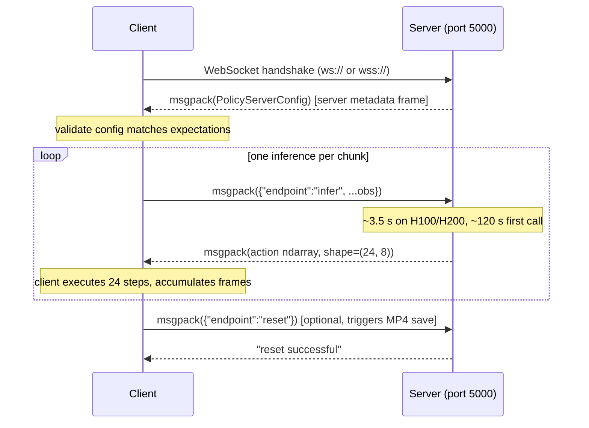

# WebSocket Protocol Reference

The DreamZero inference server speaks a **binary WebSocket** protocol with **msgpack-numpy** payloads. This document is the byte-level contract any client must satisfy.

Reference implementations:
- Server: [`server/eval_utils/policy_server.py`](../server/eval_utils/policy_server.py)
- Server entry point: [`server/socket_test_optimized_AR.py`](../server/socket_test_optimized_AR.py)
- Reference client: [`client/eval_utils/policy_client.py`](../client/eval_utils/policy_client.py)
- Smoke test: [`server/test_client_AR.py`](../server/test_client_AR.py)

---

## 1. Connection Lifecycle



Key library settings ([`policy_client.py`](../client/eval_utils/policy_client.py)):
- `compression=None`
- `max_size=None` (don't reject large frames; an obs with 4 × 180 × 320 × 3 bytes is ~700 KB)
- `ping_interval=60s`, `ping_timeout=600s` (server is busy doing inference, can't pong fast)

---

## 2. Server Metadata (Sent Once on Connect)

A `PolicyServerConfig` dataclass, defined in [`server/eval_utils/policy_server.py:19-33`](../server/eval_utils/policy_server.py):

```python
PolicyServerConfig(
    image_resolution=(180, 320),     # (H, W); client should resize images to this
    needs_wrist_camera=True,
    n_external_cameras=2,            # 0/1/2
    needs_stereo_camera=False,       # only the *_left views are needed
    needs_session_id=True,
    action_space="joint_position",   # for DROID checkpoint
)
```

The DreamZero-DROID server sends exactly:

```python
{
  "image_resolution":  [180, 320],
  "needs_wrist_camera": True,
  "n_external_cameras": 2,
  "needs_stereo_camera": False,
  "needs_session_id":   True,
  "action_space":       "joint_position",
}
```

Validate the action_space and camera count on the client side and bail if they don't match — see how [`server/test_client_AR.py:211-213`](../server/test_client_AR.py) does it.

---

## 3. Observation Payload (Client → Server)

Every infer / reset request must include an `"endpoint"` field. The server pops it before passing the rest as the observation dict.

### 3.1 Required Fields

| Key | Shape | dtype | Notes |
|---|---|---|---|
| `endpoint` | scalar str | — | `"infer"` or `"reset"` |
| `observation/exterior_image_0_left` | first call: `(180, 320, 3)`<br>after: `(4, 180, 320, 3)` | uint8 | RGB, NOT BGR |
| `observation/exterior_image_1_left` | same | uint8 | second external camera |
| `observation/wrist_image_left` | same | uint8 | gripper-mounted camera |
| `observation/joint_position` | `(7,)` | float32 | Franka joint angles in **radians** |
| `observation/cartesian_position` | `(6,)` | float32 | placeholder for DROID; can be zeros |
| `observation/gripper_position` | `(1,)` | float32 | **0=open, 1=closed** (see [§5.2](#52-gripper-state)) |
| `prompt` | str | — | natural-language task description |
| `session_id` | str | — | UUID, must stay constant for a whole episode |

### 3.2 First-Call vs Subsequent-Call Image Shape

The server keeps internal frame buffers and behaves differently:

| Call | Image shape | What gets buffered |
|---|---|---|
| **first call of a session** | `(H, W, 3)` single frame | seeds the frame buffer with one image |
| **all later calls in same session** | `(4, H, W, 3)` four frames | replaces buffer's last 4 frames |

The 4 frames must be sampled at offsets `[-23, -16, -8, 0]` from "current", where "current" means the latest frame the client has captured ([`server/test_client_AR.py:52`](../server/test_client_AR.py)). At the 15 Hz DROID control rate this spans the past ~1.53 s.

```python
RELATIVE_OFFSETS = [-23, -16, -8, 0]
ACTION_HORIZON   = 24       # one chunk = 24 steps
```

A client that captures one frame per control tick (15 Hz) needs a circular buffer of **at least 30 frames** to safely index `[-23, -16, -8, 0]`.

### 3.3 Image Format Gotchas

- **OpenCV** reads BGR by default. **You must convert to RGB** before sending: `cv2.cvtColor(bgr, cv2.COLOR_BGR2RGB)`.
- `cv2.resize` takes `(W, H)` not `(H, W)`. Numpy shape is `(H, W, C) = (180, 320, 3)`. Common bug: `cv2.resize(frame, (180, 320))` produces a 320-tall 180-wide tensor with shape `(320, 180, 3)`. Use `cv2.resize(frame, (320, 180))`.
- Three cameras must be **time-synchronized**: each call's frames should have come from approximately the same instant. Drift > 100 ms hurts performance.

---

## 4. Action Payload (Server → Client)

```
shape: (24, 8)
dtype: float32
layout:
  action[i, 0:7]  →  Franka joint position targets (radians, absolute)
  action[i, 7]    →  gripper command (continuous in [0, 1], near-bimodal)
```

Important properties:

1. **All 24 actions must be executed** before sending the next inference request. The model is open-loop within a chunk.
2. **Joint actions are absolute, not delta** — even though the model predicts deltas internally, the server adds the last reported state to convert to absolute. See [§5.1](#51-action-semantics-server-returns-absolute-joint-targets).
3. **Joint actions are in radians** matching DROID's joint convention. They lie within Franka soft limits.
4. **Gripper action is in [0, 1]**, with the **same** convention as `observation/gripper_position`: 0 = open, 1 = closed. See [§5.2](#52-gripper-state).

---

## 5. Critical Conventions

### 5.1 Action Semantics: Server Returns Absolute Joint Targets

The DROID checkpoint was trained with `relative_action: true`, so internally the model outputs `Δjoint = q_target − q_current`. **But the server already converts back to absolute** before sending it over the wire. From [`server/groot/vla/model/n1_5/sim_policy.py:602-604`](../server/groot/vla/model/n1_5/sim_policy.py):

```python
# Add state to relative action to get absolute action
unnormalized_action[action_key] = unnormalized_action[action_key] + last_state
```

So the client should treat `action[:, :7]` as **absolute target joint angles** and feed them straight to a position or impedance controller. No need to add the current state.

### 5.2 Gripper State

The convention is:

| Value | Physical State | Where Verified |
|---|---|---|
| 0.0 | gripper fully **open** | sim-evals `BinaryJointPositionZeroToOneAction` ([§3.2 of findings](03_research_findings.md)) |
| 1.0 | gripper fully **closed** | same source |

This applies to **both** `observation/gripper_position` (state) **and** `action[:, 7]` (action). The model outputs continuous values in `[0, 1]` but they are near-bimodal; binarize at 0.5 when controlling a real gripper. See [§3.4 of findings](03_research_findings.md) for the long-form derivation and rationale against linear mapping.

### 5.3 Session ID

Pass a UUID as `session_id` and **keep it constant for the whole task episode**. The server uses it to manage internal KV caches and frame buffers. Calling `reset` clears server-side episode state.

```python
import uuid
session_id = str(uuid.uuid4())  # generate once per episode, reuse for every infer call
```

### 5.4 The `reset` Endpoint

Sending `{"endpoint": "reset", ...}` causes the server to:
1. Save accumulated future-frame predictions as an MP4 in `checkpoints/.../real_world_eval_gen_<date>_<idx>/...`
2. Reset internal action/frame buffers

You may pass any extra fields in the reset payload — the server ignores them. The reply is the literal string `"reset successful"`.

You don't strictly need to call reset between episodes (rotating `session_id` works for cache invalidation), but doing so gives you an MP4 of what the model was visualizing — extremely useful for debugging.

---

## 6. Serialization

The wire format uses [`msgpack-numpy`](https://github.com/lebedov/msgpack-numpy) — vanilla msgpack with extensions for numpy arrays. Both ends use the upstream `openpi_client.msgpack_numpy.Packer` / `unpackb` helpers; do not roll your own packer.

```python
from openpi_client import msgpack_numpy

packer = msgpack_numpy.Packer()
ws.send(packer.pack(obs_dict))
response = ws.recv()                  # bytes
action = msgpack_numpy.unpackb(response)  # numpy ndarray (24, 8)
```

A `str` reply (instead of bytes) means the server raised an exception; the string is a Python traceback. The client should treat it as fatal and reconnect.

---

## 7. Throughput & Cadence

Steady-state numbers on H200, single GPU, `--enable-dit-cache`:

| Metric | Value |
|---|---|
| Inference latency | ~3.5 s per chunk |
| Action chunk size | 24 steps |
| DROID control rate | 15 Hz |
| 24 steps execute in | 1.6 s |
| **Naive sync loop end-to-end** | **5.1 s / chunk** → ~4.7 actions/s effective |
| **With async pipelining** | ~1.6 s / chunk → up to 7 Hz closed-loop |

The model card claims 7 Hz with their **DreamZero-Flash** optimization, which interleaves inference with execution. For the synchronous reference clients in this repo, expect 4-5 actions/s effective rate. See [`04_client_integration.md`](04_client_integration.md) for how to add async pipelining.

---

## 8. Compatibility With the Roboarena Server

This protocol is the upstream's **roboarena fork** (see comment in [`policy_server.py:5`](../server/eval_utils/policy_server.py)). Clients written against the original [robo-arena/roboarena](https://github.com/robo-arena/roboarena) policy interface should work unchanged, with one caveat: roboarena servers reply with `{"actions": ndarray}` whereas this server replies with the raw ndarray. The reference client wraps that for you in [`policy_client.py:76`](../client/eval_utils/policy_client.py).
